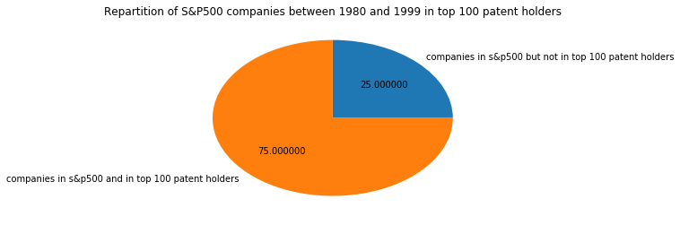
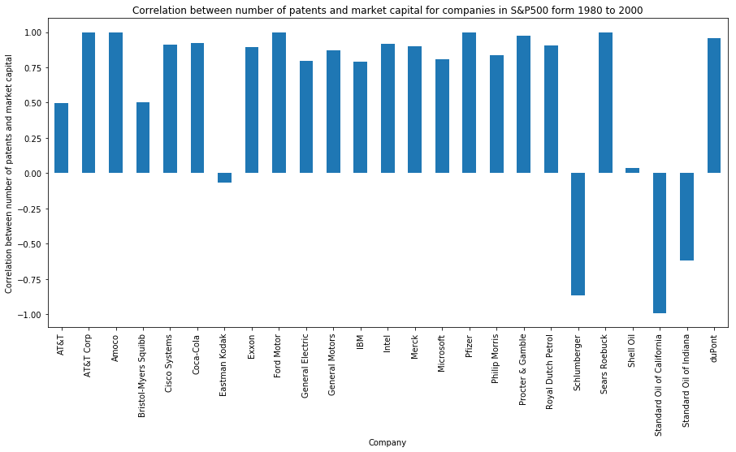
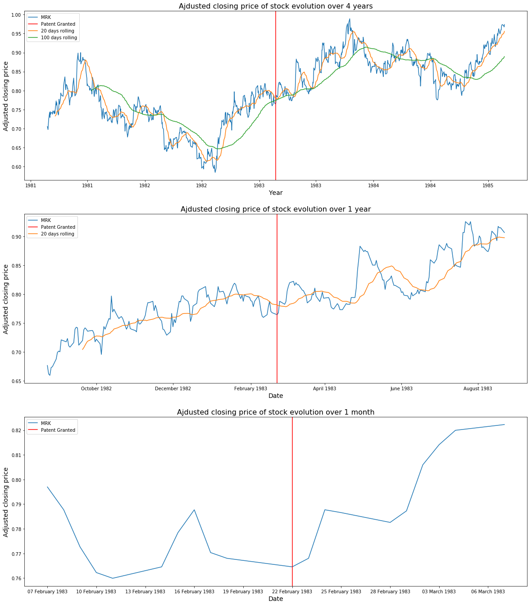
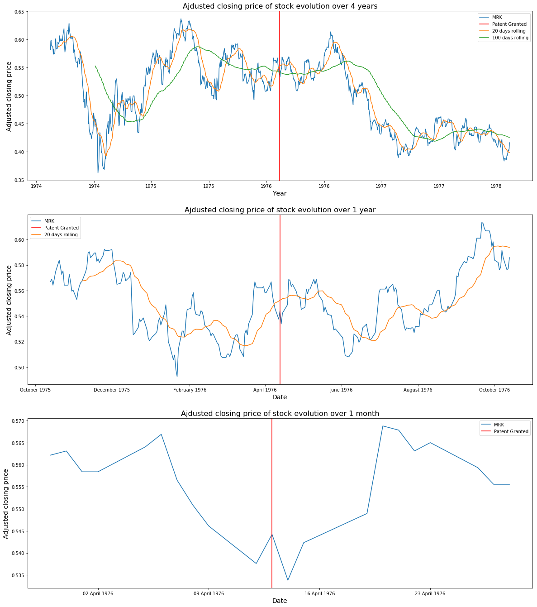

A strong company culture in innovation has always been associated with success and a high valuation. Patents are usually considered a cornerstone of innovation as they allow business to protect their intellectual property. However, does patenting inventions really lead to a higher market capitalization?

Over the past couple of months, we have researched the impact of innovation on financial markets. We collected patent information from the US National Bureau of Economic Research (NBER) and compared it with historical company valuations to determine whether patents, either in sheer numbers or in individual strengths, had any market impact.

## Act 1 - Innovation-Driven Economic Growth

We intuitively expect that in periods of economic growth, companies will be more prone to apply for new patents protecting their intellectual property. Similarly, in periods of economic slowdown, companies should be less interested in protecting _secondary_ inventions given that patenting is a relatively expensive exercise. But does that intuition verify in practice?

Below is a chart showing the evolution of the S&P 500 index along with the number of granted patents from 1980 to 2000.

Patents granted correlate very well with the S&P 500 index for this period, with both trends closely following each other. This confirms our intuition that there exists a link between the two. However, we all know that correlation does not imply causation, and so it is fair to wonder exactly what role patents play in the economic growth process. Are patents a driver of economic growth or simply one of its consequences?

## Act 2 - Leading the Market with Patents

Companies in the S&P 500 accounted for exactly 3/4 of the top 100 patent holders between 1980 and 1999. We would expect that to be the case since large corporations potentially stand the most to gain by protecting their intellectual property.

_Do companies with more patents become market leaders?_

It would intuitively make sense that innovative companies manage to capitalize on their patent portfolio to generate extra shareholder value. However, patents are not always intended to generate quick profit, but can also be used to protect against competition.

The chart below shows the Pearson correlation factors between market capitalization and number of patents granted for the top 10 companies in the S&P 500 ranging from 1980 to 2000. 

In general, the correlation is pretty strong: 0.78 for IBM, 0.79 for General Electric, 0.87 for General Motors, 0.91 for Intel, 0.92 for Coca-Cola, etc. However, there are also some surprising results. For instance, Eastman Kodak, one of the most prolific companies in terms of patent applications, stands at a -0.06 correlation factor. Oil companies fare even worse with pretty high negative correlations: -0.84 for Schlumberger, -0.66 for Standard Oil of Indiana, and -0.99 for Standard Oil of California. Interestingly, Royal Dutch Petrol and Exxon, both oil companies, display a positive correlation. In other words, some companies are not able to extract market value from their patent portfolio, and others (oil companies) are in fact seeing the exact opposite scenario: the more patents they have, the lower their valuation.

Eastman Kodak's negative correlation is easily explained by its history. In 1975, the company developed the first digital camera and promptly buried it for fear that it would eat away at its traditional photographic film business. This lack of vision from Kodak's executives enabled other companies to swoop in and disrupt the market, leaving the company with a huge patent portfolio in analogic photography which would do little to improve its bottom line.

Oil companies' negative correlations are a little more surprising, but not unexpected. First, some of these companies were created as a result of splits or mergers. For instance, Standard Oil Co was famously split in 1911 after a ruling by the US Supreme Court, and lead to the creating of various companies, which through merging and subsequent splitting make up most of the landscape of today's oil industry. It is very likely that these companies may not have retained much of their patent portfolios throughout these changes, or that patents were issued for subsidiaries or previous company names. Secondly, oil companies depend mostly on control of major oil reserves for profit, whilst technological innovation is secondary to ensure their survival and profits. As a result, oil companies are traditionally not large patent holders.

Most technology companies, whether biotech or information technology, are very large patent holders and we see a clear correlation between their market value and the size of the patent portfolios.

## Act 3 - Key Innovations Impact Market Valuation

Innovation can sometimes take years to materialize into a marketable product. This is typically the case for big pharma companies which patent medicine after spending several years of R&D and getting FDA approval. In such cases, the grant of a patent is expected to cause strong market reaction as the perspective of future benefits looms closer.

We propose to look more closely at a large pharmaceutical companies which has held spots in the top 10 of the S&P 500: Merck. We are interested in particular in their most influencial patents as these patents are likely to have the largest impact on share prices.

Different metrics can be used to determine a patent's influence. For the purposes of our analysis, we are going to use a patent citation graph and determine through graph algorithms which patents have had the most impact. Since companies tend to apply for multiple patents associated to one medicine as way of covering most of the "real estate" to protect their invention, this process has a good chance of yielding patents of high influence in which companies have invested heavily and expect to make significant profits.

### Aminoacid Derivatives Patent (1983)

Merck was granted an important patent on Aminoacid derivatives on 22 February 1983. We show the share prices (at closing time) over a period of 4 years, 1 year, and 1 month in the figure below. We mark in red the day on which that particular patent was granted.

There is clearly some impact on stock price on the day that patent was granted, as well as on subsequent days. Although this single patent is not enough to prop up the company's share price to new highs, it is part of a sustained growth trend which started in early 1982 and culminated in late 1983.

Merck's Aminoacid Derivatives patent was considered its most influential in our analysis as it is the most cited in the patent graph (i.e. highest degree vertex). This indicates that the patent was part of a larger innovation trend on the part of Merck and could explain why the company's share prices continued to grow during this period as more patents were added to complement the existing portfolio.

### Antibiotic Thienamycin (1976)

Another important patent of Merck's was on the Thienamycin Antibiotic, granted on 13 April 1976. As before, we show the share prices (at closing time) over a period of 4 years, 1 year, and 1 month below and mark the grant day in red.

Surprisingly, there is little impact from the granting of this patent, whether short term, medium term, or long term. In fact, the share price went down on 13 April 1976!

This result is explained by the fact that Thienamycin, although it is one of the most potent naturally produced antibiotics known thus far, was not directly usable as it is extremely unstable. As a result, Merck decided to patent it, knowing that applications would likely come later, and this is why the patent had little market impact: Wall Street is not particularly known for having a large horizon when looking at company news, and the announcement likely flew under the radar. Yet, it is important to realize that Thienamycin is one of Merck's most influencial patents and one of the most influencial patents in the patent citation graph overall (it was discovered using the PageRank algorithm). This shows that markets follow patents, but not necessarily right away.

--
--

### Methodology

We based our analysis on the NBER's [patent dataset](http://www.nber.org/patents/) which contains patent information from 1963 to 2000. We obtained the various datasets and merged them for analysis. We omitted patents with missing critical data (e.g., company name). We combined the NBER's patent data with Stanford's [patent citation graph](http://snap.stanford.edu/data/cit-Patents.txt.gz), allowing us to determine the influence of patents.

Financial information was obtained through 3 different sources. First, we used [ETFdb.com's top 10 of S&P 500](http://etfdb.com/history-of-the-s-and-p-500) in order to collect the top historical components of the S&P 500 and their market capitalization. We also used [Wharton Research Data Services (WRDS)](https://wrds-web.wharton.upenn.edu/wrds/) as a source of extra information regarding companies in the S&P 500. Finally, we also used [Yahoo! Finance](https://finance.yahoo.com/) to collect historical time series of stock prices for Merck and Pfizer.

Mapping company names is a tedious and complicated process, especially when it is done over a relatively long period of time, as names change due to mergers, acquisitions, splits, etc. We have done our best to properly match company names in financial information with patent data and we believe that such errors are unlikely to affect the general shape of our result or our conclusions. Please let us know if you find an error in the data.

### Data & Analysis

A Jupyther iPython notebook containing all the data used for the above analysis is available [here](https://github.com/mosimann/ADA/blob/master/Project/Project.ipynb).